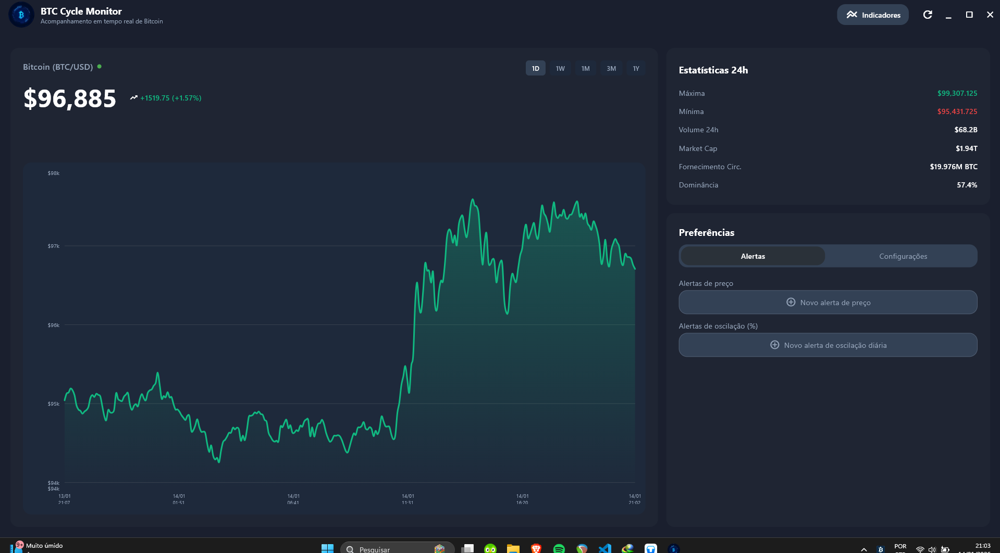
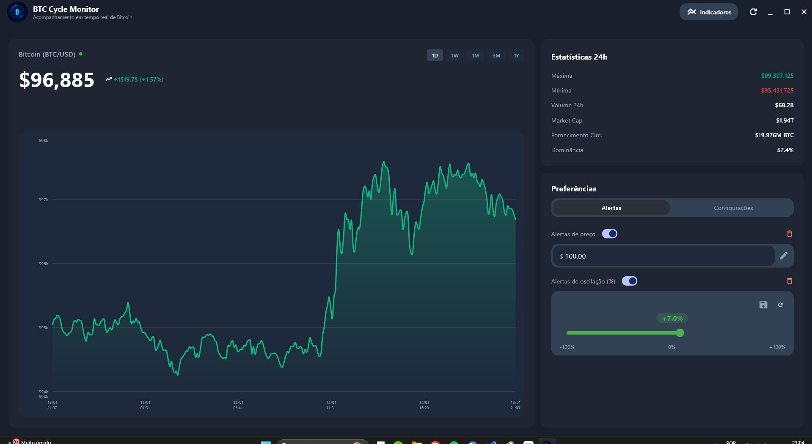
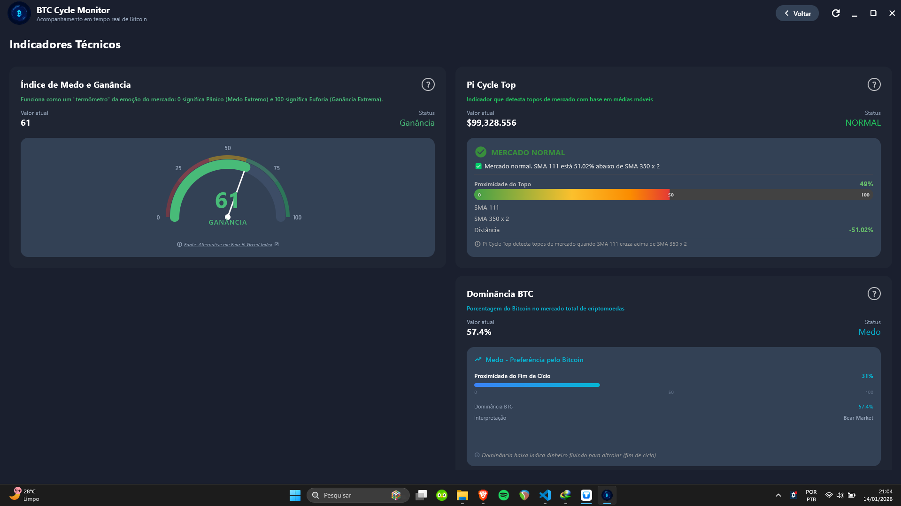

# 🪙 BTC Cycle Monitor

**Acompanhe o ciclo do Bitcoin de forma simples, visual e inteligente.**

[](https://flutter.dev/)
[](LICENSE)
[](https://github.com/ArturAfonso/Btc-Cycle-Monitor)

---

## 📊 O que é o BTC Cycle Monitor?

O **BTC Cycle Monitor** é um aplicativo desktop desenvolvido para ajudar **usuários de todos os níveis** — especialmente iniciantes — a entenderem o momento do mercado de Bitcoin, facilitando decisões de compra, venda ou acumulação (DCA/custo médio).

O app reúne os **principais indicadores técnicos** utilizados por bitcoiners experientes e traduz dados complexos em **informações visuais** e **notificações** fáceis de interpretar.

Se você não entende de gráficos, análise técnica ou quer apenas saber **quando entrar, quando sair** e **em que ponto do ciclo estamos**, este aplicativo foi feito para você!

---

## 🎯 Objetivo

### Para quem é este app?

- **Usuários leigos ou iniciantes** em Bitcoin
- Quem deseja fazer **DCA (Dollar Cost Averaging)** ou custo médio
- Pessoas que querem saber de forma simples quando o mercado está favorável para compra ou venda
- Quem busca **alertas automáticos** sem precisar entender gráficos complexos

### O que o app resolve?

- ❓ **"Devo comprar agora ou esperar?"**
- ❓ **"Estamos perto do topo ou no fundo do ciclo?"**
- ❓ **"Quando devo vender ou acumular?"**
- ❓ **"O mercado está bullish (alta) ou bearish (baixa)?"**

O **BTC Cycle Monitor** responde essas perguntas de forma visual e intuitiva!

---

## ✨ Funcionalidades Principais

### 📈 Dashboard em Tempo Real

- **Preço do Bitcoin** atualizado em tempo real
- Gráfico interativo com períodos de **1 dia, 1 semana, 1 mês, 3 meses e 1 ano**
- Estatísticas 24h: máxima, mínima, volume, market cap, fornecimento circulante e dominância
- Suporte a múltiplas moedas: **USD, BRL, EUR, GBP, JPY**



---

### 🔔 Alertas Inteligentes

Configure alertas personalizados e seja notificado automaticamente:

#### 1️⃣ **Alerta de Preço-Alvo**
- Defina um valor específico (ex: $100.000)
- Receba notificação quando o Bitcoin atingir esse preço
- Ideal para saber quando vender ou comprar

#### 2️⃣ **Alerta de Oscilação Diária**
- Configure um percentual de variação (ex: +7% ou -7%)
- Seja notificado quando o preço oscilar além do limite
- Perfeito para acompanhar volatilidade

#### 3️⃣ **Alertas Recorrentes**
- Opção de receber o mesmo alerta múltiplas vezes
- Útil para acompanhamento contínuo

**✅ Funcionam em segundo plano:** Mesmo com o app minimizado ou fechado!



---

### 📊 Indicadores Técnicos (Para Identificar o Ciclo)

O app traz 3 indicadores essenciais para saber em que momento do ciclo estamos:

#### 🎯 **Fear & Greed Index (Índice de Medo e Ganância)**
- Mostra o sentimento do mercado: **Medo Extremo (0)** até **Ganância Extrema (100)**
- **Quando usar:**
  - Medo extremo = boa hora para comprar (mercado em baixa)
  - Ganância extrema = boa hora para vender (mercado em alta)

#### 📈 **Pi Cycle Top Indicator**
- Identifica **topos de mercado** com base em médias móveis (SMA 111 e SMA 350 x 2)
- Historicamente detectou topos com alta precisão
- **Quando usar:**
  - "Mercado Normal" = ciclo saudável
  - "Aproximando do Topo" = cuidado, topo se aproximando
  - "Sinal de Topo" = possível topo de ciclo, considere vender

#### 🔵 **Dominância BTC**
- Mostra a porcentagem do Bitcoin no mercado total de criptomoedas
- Indica força do Bitcoin frente às altcoins
- **Quando usar:**
  - Alta dominância (>60%) = Bitcoin forte, altcoins fracas
  - Baixa dominância (<40%) = Altseason, Bitcoin perdendo espaço
  - Proximidade do fim do ciclo indicada visualmente



---

### ⚙️ Configurações Personalizáveis

- **Moeda de referência:** USD, BRL, EUR, GBP, JPY
- **Intervalo de atualização:** 30s, 1min, 5min, etc.
- **Tema:** Modo escuro/claro
- **Iniciar com o sistema:** Execute automaticamente ao ligar o PC
- **Notificações:** Ative/desative conforme preferir

---

## 🖼️ Capturas de Tela

### 📊 Dashboard Principal
Acompanhe o preço, gráfico e estatísticas do Bitcoin em tempo real.


---

### 🔔 Alertas e Preferências
Configure alertas de preço e oscilação, personalize moeda e notificações.


---

### 📈 Indicadores de Ciclo
Veja Fear & Greed, Pi Cycle Top e Dominância BTC para tomar decisões informadas.


---

## 🚀 Como Usar

### 1️⃣ **Pré-requisitos**

- **Flutter SDK** instalado ([Guia de instalação](https://docs.flutter.dev/get-started/install))
- **Windows 10/11** (suporte a outras plataformas em desenvolvimento)
- Chave de API da CoinGecko (opcional, mas recomendado)

### 2️⃣ **Instalação**

```bash
# Clone o repositório
git clone https://github.com/ArturAfonso/Btc-Cycle-Monitor.git

# Entre no diretório
cd Btc-Cycle-Monitor

# Instale as dependências
flutter pub get

# Crie o arquivo .env na raiz do projeto
# Copie o .env.example e adicione sua chave da API
cp .env.example .env
```

### 3️⃣ **Configuração da API**

Crie um arquivo `.env` na raiz do projeto:

```env
COINGECKO_API_KEY=sua_chave_aqui
```

> **Obtenha sua chave gratuita em:** [https://www.coingecko.com/en/api](https://www.coingecko.com/en/api)

### 4️⃣ **Executar o App**

```bash
# Modo de desenvolvimento
flutter run -d windows

# Gerar executável (release)
flutter build windows
```

O executável estará em: `build/windows/x64/runner/Release/`

---

## 🛠️ Tecnologias Utilizadas

- **Flutter** - Framework UI multiplataforma
- **Bloc/Cubit** - Gerenciamento de estado
- **Clean Architecture** - Separação de camadas (Domain, Data, Presentation)
- **Get It** - Injeção de dependências
- **SharedPreferences** - Armazenamento local
- **HTTP** - Requisições à API
- **fl_chart** - Gráficos interativos
- **flutter_dotenv** - Gerenciamento de variáveis de ambiente
- **win_toast** - Notificações nativas do Windows
- **system_tray** - Ícone na bandeja do sistema

### APIs Utilizadas

- **CoinGecko API** - Dados de preço, histórico e mercado do Bitcoin
- **Alternative.me API** - Fear & Greed Index

---

## 📂 Estrutura do Projeto

```
lib/
├── core/
│   ├── constants/        # Constantes (cores, tamanhos, etc)
│   ├── di/              # Injeção de dependências
│   ├── preferences/     # Gerenciamento de preferências
│   ├── services/        # Serviços (notificações, system tray)
│   └── utils/           # Utilitários
├── features/
│   ├── home/
│   │   ├── data/        # API, modelos, repositórios
│   │   ├── domain/      # Entidades, casos de uso
│   │   └── presentation/# UI, Cubits, widgets
│   └── indicators/
│       ├── data/
│       ├── domain/
│       └── presentation/
└── main.dart
```

---

## 🔒 Segurança e Privacidade

- ✅ **Nenhum dado pessoal é coletado ou armazenado**
- ✅ **Não requer cadastro ou login**
- ✅ **Chaves de API protegidas via `.env` (não versionadas)**
- ✅ **Todas as preferências são armazenadas localmente**
- ✅ **Código aberto e auditável**

---

## 🤝 Contribuindo

Contribuições são bem-vindas! Sinta-se à vontade para:

1. Fazer um fork do projeto
2. Criar uma branch para sua feature (`git checkout -b feature/MinhaFeature`)
3. Commit suas mudanças (`git commit -m 'Adiciona MinhaFeature'`)
4. Push para a branch (`git push origin feature/MinhaFeature`)
5. Abrir um Pull Request

**Antes de contribuir, leia [CONTRIBUTING.md](CONTRIBUTING.md)**

---

## 📝 Licença

Este projeto está sob a licença MIT. Veja o arquivo [LICENSE](LICENSE) para mais detalhes.

---

## 👨‍💻 Autor

**Artur Afonso**

- GitHub: [@ArturAfonso](https://github.com/ArturAfonso)
- LinkedIn: [Artur Afonso](https://www.linkedin.com/in/arturafonso)

---

## 🙏 Agradecimentos

- **CoinGecko** - Por fornecer API gratuita de dados de criptomoedas
- **Alternative.me** - Pelo Fear & Greed Index
- **Comunidade Flutter** - Pelas ferramentas e bibliotecas incríveis

---

## 📌 Roadmap

- [ ] Suporte para Linux e macOS
- [ ] Mais indicadores técnicos (Rainbow Chart, Stock-to-Flow, etc)
- [ ] Alertas por email/Telegram
- [ ] Histórico de alertas disparados
- [ ] Temas personalizáveis
- [ ] Suporte a múltiplas criptomoedas

---

<div align="center">

**⭐ Se este projeto foi útil para você, considere dar uma estrela!**

**💬 Dúvidas ou sugestões? Abra uma [issue](https://github.com/ArturAfonso/Btc-Cycle-Monitor/issues)!**

</div>
